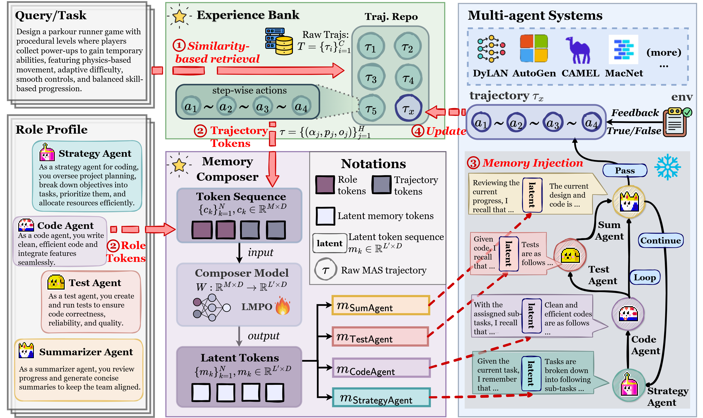

# LatentMem: Customizing Latent Memory for Multi-Agent Systems

## 👋 Introduction
This repo is the official implementation of ***LatentMem: Customizing Latent Memory for Multi-Agent Systems***.

LatentMem is a learnable multi-agent memory framework that generates role-aware, token-efficient latent memories for LLM-powered multi-agent systems (MAS). It combines a lightweight experience bank to store raw interaction trajectories with a memory composer that distills compact, role-aware latent memories conditioned on agent profiles. Using Latent Memory Policy Optimization (LMPO), LatentMem encourages the memory composer to produce high-utility, transferable representations.



## 🌎 Setup
```
conda env create -f environment.yml
conda activate latentmem
```

## 🚀 Quick Start
### 🔧 Installation: Set Up Search Environment
Please follow the instructions in the [Search-R1](https://github.com/PeterGriffinJin/Search-R1?tab=readme-ov-file#retriever-environment-optional) to configure the retriever environment (optional).

### 🤗 Model
We have released the raw trajectories (collected during data collection) and the trained LatentMem weights (via LMPO) based on Qwen3-4B-Instruct-2507 on Hugging Face: 👉 [Kana-s/LatentMem-Qwen3-4B](https://huggingface.co/Kana-s/LatentMem-Qwen3-4B). 

#### Step1: Setup Instructions
To ensure the evaluation scripts function correctly, please download the repository and place the contents into the `results/` directory as follows:
```
results/LatentMem/
├── data/             # Raw trajectories from HF
├── model/            # Trained weights from HF
└── ...
```

#### Step2: Quick Evaluation
Once the files are in place, you can verify the model performance by running the provided evaluation script:
```bash
bash scripts/eval_hf.sh
```

### ▶️ How to Run
LatentMem adopts a two-stage training pipeline. In the first stage, raw trajectories are collected on the training split and stored in an experience bank. In the second stage, the memory composer is trained using the LMPO algorithm.

#### Step 1: Data Collection
Collect raw trajectories into the experience bank:
```bash
bash scripts/data.sh
```

#### Step 2: LMPO Train
Train the memory composer using LMPO:
```bash
bash scripts/lmpo_train.sh
```

#### Step 3: Evaluate
Evaluate LatentMem:
```bash
bash scripts/eval.sh
```

## 🫡 Citation
If you find this repository helpful, a citation to our paper would be greatly appreciated:
```
@misc{fu2026latentmemcustomizinglatentmemory,
      title={LatentMem: Customizing Latent Memory for Multi-Agent Systems}, 
      author={Muxin Fu and Guibin Zhang and Xiangyuan Xue and Yafu Li and Zefeng He and Siyuan Huang and Xiaoye Qu and Yu Cheng and Yang Yang},
      year={2026},
      eprint={2602.03036},
      archivePrefix={arXiv},
      primaryClass={cs.CL},
      url={https://arxiv.org/abs/2602.03036}, 
}
```

## 🙏 Acknowledgement
We sincerely thank [Search-R1](https://github.com/PeterGriffinJin/Search-R1?tab=readme-ov-file#retriever-environment-optional) for open-sourcing their search web environment.